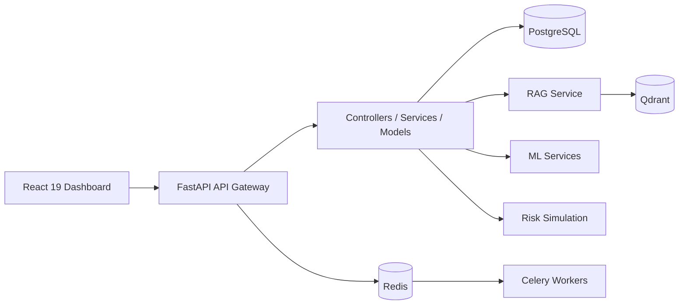
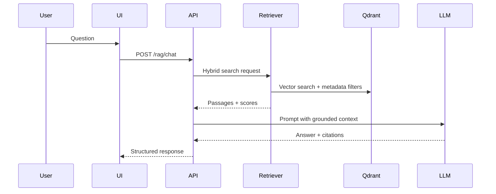
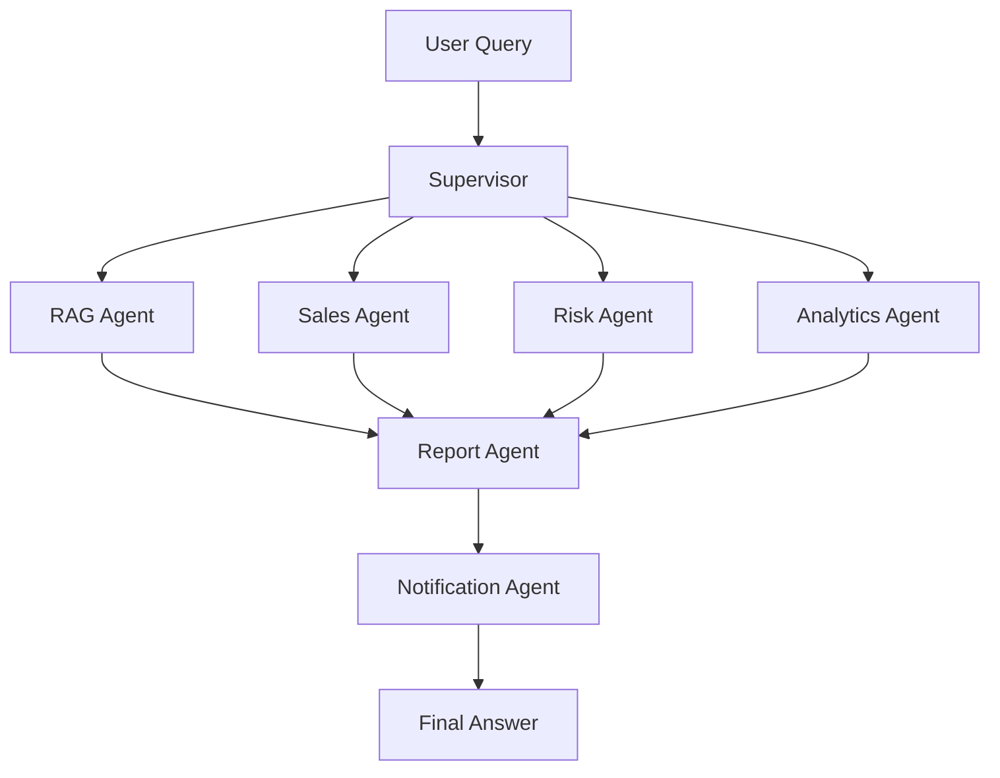
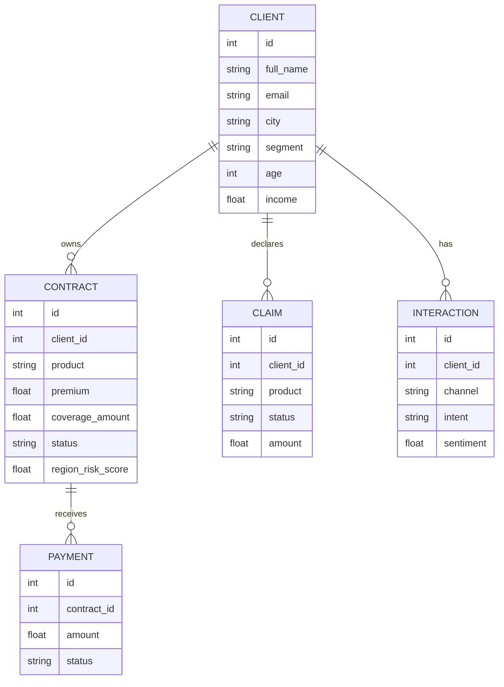

# Architecture - Insurance AI Copilot

## Vision

Insurance AI Copilot est une plateforme modulaire pour assister les equipes commerciales, risques et operations assurance. La V1 contient des services demo executables localement, avec contrats d'interface prets pour brancher Qdrant, LangGraph, des modeles ML entraines et des workers Celery.

## Architecture logique

## MVC modulaire

- `api`: controllers FastAPI, validation des entrees et orchestration HTTP.
- `schemas`: contrats Pydantic.
- `services`: logique metier, RAG, copilot, analytics, risque, alertes.
- `models`: entites SQLAlchemy.
- `db`: session et configuration persistence.
- `scripts`: generation des donnees demo.

## Modules fonctionnels

| Module | Responsabilite | Statut V1 |
| --- | --- | --- |
| Assistant RAG | Recherche hybride, reponse citee, filtrage client | Mock intelligent, interface stable |
| Sales Copilot | Cross-selling et recommandations temps reel | Regles metier scorables |
| Churn Engine | Prediction resiliation avec facteurs | Score explicable heuristique |
| Risk Exposure | Simulation catastrophe portefeuille | Stress test par contrat |
| Client 360 | Vue consolidee client | Base reelle SQL |
| Alerts | Detection des signaux prioritaires | Requetes dynamiques |
| Analytics | KPIs et graphiques | API dynamique |

## Architecture RAG cible

## Architecture LangGraph cible

## Base de donnees

## Prompts de reference

### Prompt Architecte

Conçois une architecture modulaire MVC pour une plateforme assurance IA. Separe clairement API, services metier, modeles, orchestration IA, persistence, workers async, observabilite et securite. Fournis les diagrammes C4, sequence, base de donnees, RAG et LangGraph.

### Prompt Backend

Implemente une API FastAPI propre, testable et documentee pour Insurance AI Copilot. Utilise SQLAlchemy 2, Pydantic, dependency injection, services metier isoles, endpoints REST versionnes, Swagger et gestion d'erreurs explicite.

### Prompt Frontend

Construis une application React 19 avec Vite, Tailwind CSS, shadcn/ui et Recharts. L'interface doit etre un cockpit metier dense, lisible, responsive, avec KPIs, graphes, Client 360, RAG chat, alertes et simulation risque.

### Prompt RAG

Construis un pipeline RAG hybride avec ingestion documentaire, chunking, embeddings, Qdrant, recherche vectorielle et lexicale, reranking, citations obligatoires, evaluation de groundedness et filtres par produit/client.

### Prompt ML

Developpe des modeles ML pour churn, fraude, cross-selling, risk scoring et segmentation. Inclure features, entrainement, validation, explainability, serialization, drift monitoring et endpoint d'inference.

### Prompt Data Generator

Genere des donnees assurance realistes avec Faker, NumPy et Pandas: clients, contrats, sinistres, paiements, agences, agents et interactions. Les relations doivent etre coherentes, les distributions plausibles et les anomalies exploitables pour demo IA.

## Roadmap recommandee

1. Remplacer les scores heuristiques par des modeles scikit-learn entraines.
2. Ajouter ingestion documentaire et Qdrant reel.
3. Implementer LangGraph Supervisor multi-agents.
4. Ajouter authentification JWT et roles.
5. Ajouter tests Pytest et tests UI.
6. Ajouter CI/CD, observabilite et deploiement cloud.

